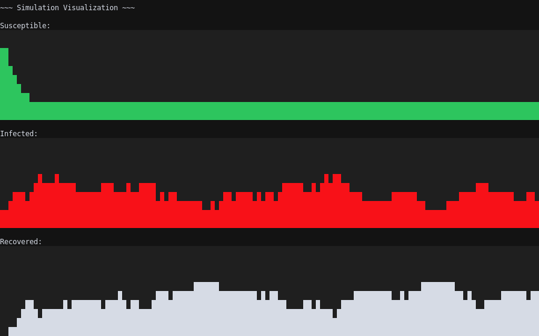

# **Simple SIR Pandemic Sim**

This is a long-form (50 years) psychological study to determine the retrospective readability of programs without comments.

---
# **Compilation and Running**
```C
make
./pansim
```

---
# **!!! Alert !!!**
Participants in the study should not be allowed to look at the section below. They will be carefully screened throughout the duration of the study (50 years) to ensure that this rule is followed. In the event of its violation, participant will be discarded from the analysis. The below section is only for researchers and third parties.

---
# **SIR Explained**
SIR (susceptible, infected, recovered) is the most primordial pandemic model the human brain can give birth to. The social network is represented by a simple directionless graph. The nodes represent people, the edges represent connections. Every person has an internal state machine, with three states - susceptible, infected, recovered. The simulation runs in discrete steps, where in each step every person has contact with every one of their neighbors. On every step we simulate every edge. Probabilities of infection, recovery, and re-infection are fixed for the entire network. A dice is rolled to attempt recovery for each participant on every step.

---
# **Parameters Explained**
| Parameter: | Description: |
| - | - |
| `clst_count` | Number of clusters in the network. |
| `clst_dist` | The function used for the distribution of cluster sizes. Options are LINEAR and CONST. |
| `con` | Coefficient of connectedness of the individuals in the network. This does absolutely nothing and is overwritten by `size`. |
| `clst_con` | Coefficient of the connectedness of clusters. Unlike `con`, this is a bit more than useless. Still, the programmers forgot how it works by the time they had to compile this document. |
| `order` | Read a Graph Theory book. |
| `size` | Refer to the description of `order`. |
| `infected_0` | Patient 0, but there's many of this. This defines how many. |
| `p_sus_inf` | Probability of going from state `SUSCEPTIBLE` to state `INFECTED`. |
| `p_inf_rec` | Probability of going from state `INFECTED` to state `RECOVERED`. |
| `p_rec_inf` | Probability of going from state `RECOVERED` to state `INFECTED`. |
| `time` | Duration of the simulation, in number of discrete steps. |

